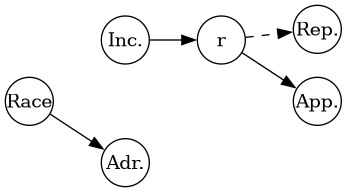

---
jupyter:
  jupytext:
    text_representation:
      extension: .Rmd
      format_name: rmarkdown
      format_version: '1.2'
      jupytext_version: 1.19.1
  kernelspec:
    display_name: Python 3 (ipykernel)
    language: python
    name: python3
---

```{python slideshow={'slide_type': 'skip'}, editable=TRUE}
import numpy as np
from scipy.stats import bernoulli, norm, rv_discrete, beta, binom
import matplotlib.pyplot as plt
import pandas as pd
from sklearn.metrics import confusion_matrix
```

<!-- #region slideshow={"slide_type": "slide"} editable=true -->
# Fairness
<!-- #endregion -->

<!-- #region slideshow={"slide_type": "slide"} editable=true -->
# Ethics
<!-- #endregion -->

<!-- #region slideshow={"slide_type": "slide"} editable=true -->
</img>
<!-- #endregion -->

<!-- #region slideshow={"slide_type": "slide"} editable=true -->
 * What impact you algorithm will have?
 * How it will be used?
 * Is it explainable?
 * Does user know that the algorithm is used?
 * Can user make an appeal? 
 * Is it corrected during use?  Is it any feedback and finetuning?
 * What goal is the algorithm optimising? 
 * Cant it lead to "vicious circles"?
<!-- #endregion -->

<!-- #region slideshow={"slide_type": "slide"} editable=true -->
## Using algorithms does not guaranties fairness and/or objectivity !
<!-- #endregion -->

<!-- #region slideshow={"slide_type": "slide"} editable=true -->
</img>
<!-- #endregion -->

<!-- #region editable=true slideshow={"slide_type": "skip"} -->
Image taken from [Marvel project site](https://www.marvel-project.eu/fairness-in-machine-learning/)
<!-- #endregion -->

<!-- #region slideshow={"slide_type": ""} editable=true -->
[A Tutorial on Fairness in Machine Learning](https://towardsdatascience.com/a-tutorial-on-fairness-in-machine-learning-3ff8ba1040cb)

[Fairness and machine learning](https://fairmlbook.org)
<!-- #endregion -->

<!-- #region slideshow={"slide_type": "slide"} editable=true -->
# Classifier
<!-- #endregion -->

<!-- #region editable=true slideshow={"slide_type": "skip"} -->
We start with a dataset with features devided into two groups $X$ and $A$. Features from group $A$ are so called _sensitive features_ , ones that we are no allowed to discriminate. $Y$ are the labels we would like to predict.
<!-- #endregion -->

<!-- #region slideshow={"slide_type": "fragment"} editable=true -->
$$(X,A),\;Y$$
<!-- #endregion -->

<!-- #region editable=true slideshow={"slide_type": "skip"} -->
Based on this dataset we  construct a classifier $f$ that predicts the labels. We will call the result of this classifier $R$
<!-- #endregion -->

<!-- #region slideshow={"slide_type": "fragment"} editable=true -->
$$
f(X,A)\rightarrow R
$$
<!-- #endregion -->

<!-- #region slideshow={"slide_type": "skip"} editable=true -->
We can ask about fairness of both dataset and classifier. We will discuss  different issues that arise with a simple artificial example given below.
<!-- #endregion -->

<!-- #region slideshow={"slide_type": "slide"} editable=true -->
</img>
<!-- #endregion -->

<!-- #region editable=true slideshow={"slide_type": "skip"} -->
The example will consist of artificially generated data set regarding credit approval. We assume that we have two social classes (called races): a discreminated one which I will call minority (label 0) and the majority class (label 1). I assume that the income is divided in four different classes numbered from zero to three whith zero being low income and three being high income. The distribution of income in each social group is different, with the minority group being largely low income. After approval the probability of repaying the loan depends only on the income class. Consequently the approval  decision should be taken only on the basis of the repayment probability and hence only on the income class. In reality they may be an illegal discrimination where the approval depends directly on the  race (red arrow on the graph). We have also an address feature. Address may be one of two neighborhoods, with labels 0 and 1, with probability of living in a specified neigbourhood depending on the social class. 
<!-- #endregion -->

```{python slideshow={'slide_type': 'skip'}, editable=TRUE}
n_credits = 100000
repay_p   = np.asarray([0.2, 0.4, 0.6, 0.9]) # probability of repaying the credit in each income class
address_p = np.asarray([0.4, 0.7]) # probability of for a person of each class to live in  neighborhood 1.
```

<!-- #region editable=true slideshow={"slide_type": "skip"} -->
Function below generates the data set takin into account all the above consideration including an explicit bias against the minority group. 
<!-- #endregion -->

```{python slideshow={'slide_type': 'slide'}, editable=TRUE}
def gen_data(n_credits, b, income_p, seed = None):
    if seed is not None:
      np.random.seed(seed)
    bias=np.asarray(b)
    race = bernoulli(p=0.5).rvs(n_credits) 
    credit = pd.DataFrame(race, columns=['race'])
    min_income_dist = rv_discrete(values=(range(4), income_p[0]))
    maj_income_dist = rv_discrete(values=(range(4), income_p[1]))
    credit['income'] = np.where(credit['race']==0, min_income_dist.rvs(size=n_credits),  maj_income_dist.rvs(size=n_credits) )
    credit['repayed'] = bernoulli(p=repay_p[credit['income'].values]).rvs()
    credit['address'] = bernoulli(p=address_p[credit['race'].values]).rvs()
    credit['score']= np.clip(repay_p[credit['income']]+bias[credit['race']],0,1)
    credit['approved']= 0+(credit['score']>0.5)
    credit['repayed'] = bernoulli(p=repay_p[credit['income'].values]).rvs()
    return credit
```

<!-- #region editable=true slideshow={"slide_type": "skip"} -->
Please note that the 'repayed' column includes also the case where the credit was not approved which of course is not available in reality. 
<!-- #endregion -->

```{python slideshow={'slide_type': 'skip'}, editable=TRUE}

def select(credit, r, key='race'):
    return credit.loc[credit[key]==r]
```

<!-- #region slideshow={"slide_type": "slide"} editable=true -->
# Very fair sample
<!-- #endregion -->

<!-- #region editable=true slideshow={"slide_type": "skip"} -->
We start by a "very fair" example of an ideal world where the income does not depend on race and there is no bias. 
<!-- #endregion -->

```{python slideshow={'slide_type': 'skip'}, editable=TRUE}
adg = graphviz.Digraph(node_attr = {'shape': 'circle'}, format='png')
adg.attr(rankdir='LR')
adg.attr('node', fixedsize='true')
adg.node('Race')
adg.node('Inc.')
adg.edge('Race','Inc.',style='invis')
adg.edge('Inc.','r')
adg.edge('Race','App.', color='red', style='invis')
adg.edge('r','Rep.', style='dashed')
adg.edge('r','App.')
adg.edge('Race','Adr.')
adg.render('very_fair_credit');
```

<!-- #region editable=true slideshow={"slide_type": "slide"} -->
</img>
<!-- #endregion -->

```{python slideshow={'slide_type': 'fragment'}, editable=TRUE}
credit_very_fair = gen_data(n_credits,(0,0), income_p=[[0.2, 0.3, 0.3,0.2],[0.2, 0.3,0.3, 0.2]])
```

```{python editable=TRUE, slideshow={'slide_type': 'slide'}}
credit_very_fair.head()
```

```{python editable=TRUE, slideshow={'slide_type': 'fragment'}}
minority_very_fair = select(credit_very_fair,0)
majority_very_fair = select(credit_very_fair,1)
```

<!-- #region editable=true slideshow={"slide_type": "skip"} -->
In the following we will try to estimate if the data sets we have produced are fair. Which imediatelly leads to a question:
<!-- #endregion -->

<!-- #region slideshow={"slide_type": "slide"} editable=true -->
# How to define fairness ?
<!-- #endregion -->

<!-- #region slideshow={"slide_type": "slide"} editable=true -->
## Independence
<!-- #endregion -->

<!-- #region editable=true slideshow={"slide_type": "skip"} -->
The simplest or naive answer would be that the result $R$ (here the credit approval) is independend of the race which will be denoted by the $\bot$ symbol
<!-- #endregion -->

<!-- #region slideshow={"slide_type": "fragment"} editable=true -->
$$ R \,\bot\, A$$
<!-- #endregion -->

<!-- #region editable=true slideshow={"slide_type": "skip"} -->
By definition of the independence this implies that
<!-- #endregion -->

<!-- #region slideshow={"slide_type": "fragment"} editable=true -->
$$P(R=r|A=a)=P(R=r)$$
<!-- #endregion -->

<!-- #region slideshow={"slide_type": "fragment"} editable=true -->
$$P(R = 1| A = m) = P(R= 1| A=M)$$
<!-- #endregion -->

<!-- #region editable=true slideshow={"slide_type": "skip"} -->
This means that the  approval rate is the same in both groups. That is why this requirement is often refered to as _demographic_ parity. 
<!-- #endregion -->

<!-- #region editable=true slideshow={"slide_type": "skip"} -->
And we can check that this is the case in this example
<!-- #endregion -->

```{python slideshow={'slide_type': 'slide'}, editable=TRUE}
minority_very_fair['approved'].mean()
```

```{python slideshow={'slide_type': ''}, editable=TRUE}
majority_very_fair['approved'].mean()
```

<!-- #region slideshow={"slide_type": "slide"} editable=true -->
## Separation
<!-- #endregion -->

<!-- #region editable=true slideshow={"slide_type": "skip"} -->
Demographic parity most of the time will be a too strong requirement. Instead of the independence we may ask for independence of the result from the race _conditioned_ on the the $Y$ that is the true label. 
<!-- #endregion -->

<!-- #region slideshow={"slide_type": "fragment"} editable=true -->
$$R\,\bot\,A\, |\, Y$$
<!-- #endregion -->

<!-- #region editable=true slideshow={"slide_type": "skip"} -->
By definition that means that if we select only persons with a given label $y$ then the result should not depend on the sensitive feature $A$
<!-- #endregion -->

<!-- #region slideshow={"slide_type": "fragment"} editable=true -->
$$P(R=r|A=a,Y=y)=P(R=r|Y=y)$$
<!-- #endregion -->

<!-- #region slideshow={"slide_type": "fragment"} editable=true -->
$$P(R=1|A=m,Y=1) = P(R=1|Y=1)= P(R=1|A=M,Y=1)$$
<!-- #endregion -->

<!-- #region slideshow={"slide_type": "fragment"} editable=true -->
$$P(R=0|A=m,Y=1) = P(R=0|Y=1)= P(R=0|A=M,Y=1)$$
<!-- #endregion -->

<!-- #region editable=true slideshow={"slide_type": "skip"} -->
That translates into 
<!-- #endregion -->

<!-- #region slideshow={"slide_type": "fragment"} editable=true -->
$$TPR_m = TPR_M, \quad  FNR_m=FNR_M$$
<!-- #endregion -->

<!-- #region editable=true slideshow={"slide_type": "skip"} -->
which means that false negative rate is independent of $A$. Similarly 
<!-- #endregion -->

<!-- #region slideshow={"slide_type": "slide"} editable=true -->
$$P(R=0|A=m,Y=0) = P(R=0|Y=0)= P(R=0|A=M,Y=0)$$
<!-- #endregion -->

<!-- #region slideshow={"slide_type": "fragment"} editable=true -->
$$P(R=1|A=m,Y=0) = P(R=1|Y=0)= P(R=1|A=M,Y=0)$$
<!-- #endregion -->

<!-- #region slideshow={"slide_type": "fragment"} editable=true -->
$$TNR_m = TNR_M,\quad FPR_m=FPR_M$$
<!-- #endregion -->

<!-- #region editable=true slideshow={"slide_type": "skip"} -->
In our case (and in many similar cases) we have only access to false positives. We can only check if a person for which the credit was approved did repay it or not. We do not know how many persons denied credit would have repayed it. 
<!-- #endregion -->

<!-- #region editable=true slideshow={"slide_type": "slide"} -->
<table style="font-size:1.5em;">
<tr> <th/><th colspan=2>predicted</th></tr>
<tr> <th>True</th><th>N</th><th>P</th><th>total</th></tr>
<tr> <th>N</th> <td>TN</td> <td>FP</td><td>N</td></tr>
<tr> <th>P</th> <td>FN</td> <td>TP</td><td>P</td></tr>
</table>
<!-- #endregion -->

<!-- #region editable=true slideshow={"slide_type": "skip"} -->
Unfortunately in our example in real life we cannot estimate those metrics, as we are missing some of the data.  
<!-- #endregion -->

<!-- #region editable=true slideshow={"slide_type": "fragment"} -->
<table style="font-size:1.5em;">
<tr> <th/><th colspan=2>predicted</th></tr>
<tr> <th>True</th><th>N</th><th>P</th></tr>
<tr> <th>N</th> <td>na</td> <td>FP</td></tr>
<tr> <th>P</th> <td>na</td> <td>TP</td></tr>
</table>
<!-- #endregion -->

<!-- #region editable=true slideshow={"slide_type": "skip"} -->
But we can still measure them on the artificial dataset.
<!-- #endregion -->

```{python editable=TRUE, slideshow={'slide_type': 'slide'}}
confusion_matrix(minority_very_fair.repayed, minority_very_fair.approved, normalize='true')
```

```{python editable=TRUE, slideshow={'slide_type': ''}}
confusion_matrix(majority_very_fair.repayed, majority_very_fair.approved, normalize='true')
```

<!-- #region slideshow={"slide_type": "slide"} editable=true -->
## Sufficiency 
<!-- #endregion -->

<!-- #region editable=true slideshow={"slide_type": "skip"} -->
Third and last criterion is the independence of $Y$ and $A$ conditioned on $R$
<!-- #endregion -->

<!-- #region slideshow={"slide_type": "slide"} editable=true -->
$$Y \, \bot \,  A\, | \, R$$
<!-- #endregion -->

<!-- #region editable=true slideshow={"slide_type": "skip"} -->
That means that if we predict outcome $R=r$ the probability of real outcome $Y=y$ does not depend on $A$. For example the quantity below
<!-- #endregion -->

<!-- #region slideshow={"slide_type": "fragment"} editable=true -->
$$P(Y=1| R=1, A=m) = P(Y=1| R=1, A=M)$$
<!-- #endregion -->

<!-- #region editable=true slideshow={"slide_type": "skip"} -->
is called Positive Predictive Value and can be calculated in our example
<!-- #endregion -->

```{python editable=TRUE, slideshow={'slide_type': 'fragment'}}
minority_very_fair[minority_very_fair['approved']==1]['repayed'].mean()
```

```{python editable=TRUE, slideshow={'slide_type': 'fragment'}}
majority_very_fair[majority_very_fair['approved']==1]['repayed'].mean()
```

<!-- #region editable=true slideshow={"slide_type": "skip"} -->
Quantity below is called False Omission Ratio 
<!-- #endregion -->

<!-- #region slideshow={"slide_type": "slide"} editable=true -->
$$P(Y=1| R=0, A=m) = P(Y=1| R=0, A=M)$$
<!-- #endregion -->

<!-- #region editable=true slideshow={"slide_type": "skip"} -->
and is not accesible in our dataset if we treat is as a real data. However we may still calculate this quantity in our artificial dataset
<!-- #endregion -->

```{python editable=TRUE, slideshow={'slide_type': 'slide'}}
confusion_matrix(minority_very_fair.repayed, minority_very_fair.approved, normalize='pred')
```

```{python editable=TRUE, slideshow={'slide_type': ''}}
confusion_matrix(majority_very_fair.repayed, majority_very_fair.approved, normalize='pred')
```

<!-- #region editable=true slideshow={"slide_type": "slide"} -->
## Calibration
<!-- #endregion -->

<!-- #region editable=true slideshow={"slide_type": "skip"} -->
Very often our classifier will be based on a _score_ $S$. In our example the score is the estimated repayment probability. We may demand that the outcome conditioned on  $S$ will be independent from $A$
<!-- #endregion -->

<!-- #region slideshow={"slide_type": "slide"} editable=true -->
$$Y \, \bot \,  A\, | \, S$$
<!-- #endregion -->

<!-- #region editable=true slideshow={"slide_type": "fragment"} -->
$$P(Y=1|S=s,A=m)=P(Y=1|S=s,A=M)$$
<!-- #endregion -->

<!-- #region editable=true slideshow={"slide_type": "skip"} -->
Often the score $S$ is interpreted as a probability like in our case. The classifier is said to be calibrated if the probability of the outcome matches the predicted probability  
<!-- #endregion -->

<!-- #region editable=true slideshow={"slide_type": "fragment"} -->
$$P(Y=1|S=s)=s$$
<!-- #endregion -->

<!-- #region editable=true slideshow={"slide_type": "skip"} -->
Calibration is an issue which can be considered independently of the fairness.   
<!-- #endregion -->

```{python editable=TRUE, slideshow={'slide_type': ''}}
select(credit_very_fair, 1, key='approved').groupby('score').mean()[['repayed']]
```

```{python editable=TRUE, slideshow={'slide_type': 'slide'}}
select(minority_very_fair, 1, key='approved').groupby('score').mean()[['repayed']]
```

```{python editable=TRUE, slideshow={'slide_type': 'fragment'}}
select(majority_very_fair, 1, key='approved').groupby('score').mean()[['repayed']]
```

```{python editable=TRUE, slideshow={'slide_type': 'slide'}}
credit_very_fair.groupby('score').mean()[['repayed']]
```

<!-- #region slideshow={"slide_type": "slide"} editable=true -->
# Fair sample
<!-- #endregion -->

<!-- #region editable=true slideshow={"slide_type": "skip"} -->
The example above was unfortunately not very realistic. In real life the income will depend or be correlated with the race or gender. We will not discuss here the fairness of that, that is another issue :( Our next example will be fair in that respect that the approval decision will be based solely on the income. Income however will depend on the social group.     
<!-- #endregion -->

```{python slideshow={'slide_type': 'skip'}, editable=TRUE}
adg = graphviz.Digraph(node_attr = {'shape': 'circle'}, format='png')
adg.attr(rankdir='LR')
adg.attr('node', fixedsize='true')
adg.node('Race')
adg.node('Inc.')
adg.edge('Race','Inc.')
adg.edge('Inc.','r')
adg.edge('Race','App.', color='red', style='invis')
adg.edge('r','Rep.', style='dashed')
adg.edge('r','App.')
adg.edge('Race','Adr.')
adg.render("credit_fair");
```

<!-- #region editable=true slideshow={"slide_type": "slide"} -->
</img>
<!-- #endregion -->

```{python slideshow={'slide_type': 'fragment'}, editable=TRUE}
credit_fair = gen_data(n_credits,(0,0), income_p=np.asarray([[0.4,0.3,0.2,0.1],[0.1,0.2,0.3,0.4]]) )
```

```{python editable=TRUE, slideshow={'slide_type': 'fragment'}}
minority_fair = select(credit_fair,0)
majority_fair = select(credit_fair,1)
```

<!-- #region slideshow={"slide_type": "slide"} editable=true -->
## Independence
<!-- #endregion -->

<!-- #region slideshow={"slide_type": "slide"} editable=true -->
$$ R \,\bot\, A$$
<!-- #endregion -->

<!-- #region slideshow={"slide_type": "fragment"} editable=true -->
$$P(R = 1| A = m) = P(R= 1| A=M)$$
<!-- #endregion -->

<!-- #region editable=true slideshow={"slide_type": "skip"} -->
Of course there is no way that the demographic parity will be satified, but it was not expected
<!-- #endregion -->

```{python slideshow={'slide_type': 'fragment'}, editable=TRUE}
select(credit_fair,0)['approved'].mean()
```

```{python slideshow={'slide_type': 'fragment'}, editable=TRUE}
select(credit_fair,1)['approved'].mean()
```

<!-- #region slideshow={"slide_type": "slide"} editable=true -->
## Conditional independence
<!-- #endregion -->

<!-- #region editable=true slideshow={"slide_type": "skip"} -->
If we condition on the income. The result will no longer depend on the sensitive attribute
<!-- #endregion -->

<!-- #region slideshow={"slide_type": "fragment"} editable=true -->
$$P(R = 1| A = m, I=i) = P(R= 1| A=M, I=i)$$
<!-- #endregion -->

```{python slideshow={'slide_type': 'fragment'}, editable=TRUE}
for i in range(4):
    a =  minority_fair.loc[minority_fair['income']==i]['approved'].mean()
    b =  majority_fair.loc[majority_fair['income']==i]['approved'].mean()
    print(i,a,b)
```

<!-- #region slideshow={"slide_type": "slide"} editable=true -->
## Separation
<!-- #endregion -->

<!-- #region editable=true slideshow={"slide_type": "slide"} -->
$$R\,\bot\,A\, |\, Y$$
<!-- #endregion -->

<!-- #region editable=true slideshow={"slide_type": ""} -->
$$P(R=1|A=m,Y=1) = P(R=1|Y=1)= P(R=1|A=M,Y=1)$$
<!-- #endregion -->

<!-- #region editable=true slideshow={"slide_type": ""} -->
$$TPR_m = TPR_M, \quad  FNR_m=FNR_M$$
<!-- #endregion -->

<!-- #region editable=true slideshow={"slide_type": "slide"} -->
$$P(R=0|A=m,Y=0) = P(R=1|Y=0)= P(R=0|A=M,Y=0)$$
<!-- #endregion -->

<!-- #region editable=true slideshow={"slide_type": ""} -->
$$TNR_m = TNR_M,\quad FPR_m=FPR_M$$
<!-- #endregion -->

```{python slideshow={'slide_type': 'slide'}, editable=TRUE}
confusion_matrix(minority_fair['repayed'], minority_fair['approved'], normalize='true')
```

```{python editable=TRUE, slideshow={'slide_type': ''}}
confusion_matrix(majority_fair['repayed'], majority_fair['approved'], normalize='true')
```

<!-- #region editable=true slideshow={"slide_type": "skip"} -->
$$P(S=s|Y=1)=\frac{P(Y=1|S=s)P(S=s)}{\sum_s P(Y=1|S=s) P(S=s)}$$
<!-- #endregion -->

<!-- #region editable=true slideshow={"slide_type": "skip"} -->
$$P(R=1|Y=1)=\sum_{s>s_{tr}} P(S=s| Y=1)$$
<!-- #endregion -->

```{python editable=TRUE, slideshow={'slide_type': 'skip'}}
np.sum([0.4, 0.3, 0.2, 0.1]*repay_p)
```

```{python editable=TRUE, slideshow={'slide_type': 'skip'}}
np.sum([ 0.2, 0.1]*repay_p[2:])
```

```{python editable=TRUE, slideshow={'slide_type': 'skip'}}
_/__
```

<!-- #region slideshow={"slide_type": "slide"} editable=true -->
## Sufficiency
<!-- #endregion -->

<!-- #region editable=true slideshow={"slide_type": "slide"} -->
$$Y \, \bot \,  A\, | \, R$$
<!-- #endregion -->

<!-- #region editable=true slideshow={"slide_type": "fragment"} -->
$$P(Y=1| R=1, A=m) = P(Y=1| R=1, A=M)$$
<!-- #endregion -->

```{python editable=TRUE, slideshow={'slide_type': 'fragment'}}
minority_fair.loc[minority_fair['approved']==1]['repayed'].mean()
```

```{python editable=TRUE, slideshow={'slide_type': 'fragment'}}
majority_fair.loc[majority_fair['approved']==1]['repayed'].mean()
```

```{python editable=TRUE, slideshow={'slide_type': 'slide'}}
confusion_matrix(minority_fair.repayed, minority_fair.approved, normalize='pred')
```

```{python editable=TRUE, slideshow={'slide_type': 'fragment'}}
confusion_matrix(majority_fair.repayed, majority_fair.approved, normalize='pred')
```

<!-- #region editable=true slideshow={"slide_type": "slide"} -->
### Calibration
<!-- #endregion -->

<!-- #region editable=true slideshow={"slide_type": "fragment"} -->
$$P(Y=1|S=s)=s$$
<!-- #endregion -->

```{python editable=TRUE, slideshow={'slide_type': 'slide'}}
select(credit_fair, 1, key='approved').groupby('score').mean()[['repayed']]
```

```{python editable=TRUE, slideshow={'slide_type': 'fragment'}}
select(minority_fair, 1, key='approved').groupby('score').mean()[['repayed']]
```

```{python editable=TRUE, slideshow={'slide_type': 'fragment'}}
select(majority_fair, 1, key='approved').groupby('score').mean()[['repayed']]
```

```{python editable=TRUE, slideshow={'slide_type': 'slide'}}
credit_fair.groupby('score').mean()[['repayed']]
```

<!-- #region editable=true slideshow={"slide_type": "skip"} -->
So what happened here? Why in spite of our classifier being well calibrated the sufficiency criterion is not satisfied? The answer lies just in the probability calculus. 
<!-- #endregion -->

<!-- #region editable=true slideshow={"slide_type": "slide"} -->
$$P(Y=1|R=1,A=a)=
\frac{
\sum_{s>s_{th}}P(Y=1|S=s,A=a)P(S=s,A=a)}{\sum_{s>s_{th}}P(S=s,A=a)}$$
<!-- #endregion -->

```{python editable=TRUE, slideshow={'slide_type': 'fragment'}}
pd.DataFrame({'S': repay_p, 'minority': [.4, .3, .2,.1], 'majority': [.1,.2, .3, .4]})
```

```{python editable=TRUE, slideshow={'slide_type': 'skip'}}
0.6*2/3+0.9/3
```

<!-- #region editable=true slideshow={"slide_type": "slide"} -->
$$P(Y=1|R=1,A=m) = 0.6\times\frac{2}{3} + 0.9\times\frac{1}{3} = 0.7$$
<!-- #endregion -->

```{python editable=TRUE, slideshow={'slide_type': 'skip'}}
0.6*3/7+0.9*4/7
```

<!-- #region editable=true slideshow={"slide_type": "fragment"} -->
$$P(Y=1|R=1,A=M) = 0.6\times\frac{3}{7} + 0.9\times\frac{4}{7} \approx 0.77$$
<!-- #endregion -->

<!-- #region slideshow={"slide_type": "slide"} editable=true -->
# Unfair sample
<!-- #endregion -->

```{python slideshow={'slide_type': 'skip'}, editable=TRUE}
adg = graphviz.Digraph(node_attr = {'shape': 'circle'})
adg.attr(rankdir='LR')
adg.attr('node', fixedsize='true')
adg.node('Race')
adg.node('Inc.')
adg.edge('Race','Inc.')
adg.edge('Inc.','r')
adg.edge('Race','r', color='red')
adg.edge('r','Rep.', style='dashed')
adg.edge('r','App.')
adg.edge('Race','Adr.')
adg.render('credit_unfair', format='png');
```

<!-- #region editable=true slideshow={"slide_type": "slide"} -->
</img>
<!-- #endregion -->

```{python slideshow={'slide_type': 'fragment'}, editable=TRUE}
credit_unfair = gen_data(n_credits, b=[-0.125,0],  income_p=np.asarray([[0.4,0.3,0.2,0.1],[0.1,0.2,0.3,0.4]]) )
```

```{python editable=TRUE, slideshow={'slide_type': 'fragment'}}
minority_unfair = select(credit_unfair,0)
majority_unfair = select(credit_unfair,1)
```

<!-- #region slideshow={"slide_type": "slide"} editable=true -->
## Independence
<!-- #endregion -->

<!-- #region slideshow={"slide_type": "slide"} editable=true -->
$$ R \,\bot\, A$$
<!-- #endregion -->

<!-- #region slideshow={"slide_type": "fragment"} editable=true -->
$$P(R = 1| A = m) = P(R= 1| A=M)$$
<!-- #endregion -->

```{python slideshow={'slide_type': 'fragment'}, editable=TRUE}
select(credit_unfair,0)['approved'].mean()
```

```{python slideshow={'slide_type': 'fragment'}, editable=TRUE}
select(credit_unfair,1)['approved'].mean()
```

<!-- #region slideshow={"slide_type": "slide"} editable=true -->
## Conditional independence
<!-- #endregion -->

<!-- #region editable=true slideshow={"slide_type": "skip"} -->
If we condition on the income. The result will no longer depend on the sensitive attribute
<!-- #endregion -->

<!-- #region slideshow={"slide_type": "fragment"} editable=true -->
$$P(R = 1| A = m, I=i) = P(R= 1| A=M, I=i)$$
<!-- #endregion -->

```{python slideshow={'slide_type': 'fragment'}, editable=TRUE}
for i in range(4):
    a =  minority_unfair.loc[minority_unfair['income']==i]['approved'].mean()
    b =  majority_unfair.loc[majority_unfair['income']==i]['approved'].mean()
    print(i,a,b)
```

<!-- #region slideshow={"slide_type": "slide"} editable=true -->
## Separation
<!-- #endregion -->

<!-- #region editable=true slideshow={"slide_type": "slide"} -->
$$R\,\bot\,A\, |\, Y$$
<!-- #endregion -->

<!-- #region editable=true slideshow={"slide_type": ""} -->
$$P(R=1|A=m,Y=1) = P(R=1|Y=1)= P(R=1|A=M,Y=1)$$
<!-- #endregion -->

<!-- #region editable=true slideshow={"slide_type": ""} -->
$$TPR_m = TPR_M, \quad  FNR_m=FNR_M$$
<!-- #endregion -->

<!-- #region editable=true slideshow={"slide_type": "slide"} -->
$$P(R=0|A=m,Y=0) = P(R=1|Y=0)= P(R=0|A=M,Y=0)$$
<!-- #endregion -->

<!-- #region editable=true slideshow={"slide_type": ""} -->
$$TNR_m = TNR_M,\quad FPR_m=FPR_M$$
<!-- #endregion -->

```{python slideshow={'slide_type': 'slide'}, editable=TRUE}
confusion_matrix(minority_unfair['repayed'], minority_unfair['approved'], normalize='true')
```

```{python editable=TRUE, slideshow={'slide_type': 'fragment'}}
confusion_matrix(majority_unfair['repayed'], majority_unfair['approved'], normalize='true')
```

<!-- #region slideshow={"slide_type": "slide"} editable=true -->
## Sufficiency
<!-- #endregion -->

<!-- #region editable=true slideshow={"slide_type": "slide"} -->
$$Y \, \bot \,  A\, | \, R$$
<!-- #endregion -->

<!-- #region editable=true slideshow={"slide_type": "fragment"} -->
$$P(Y=1| R=1, A=m) = P(Y=1| R=1, A=M)$$
<!-- #endregion -->

```{python editable=TRUE, slideshow={'slide_type': 'fragment'}}
minority_unfair.loc[minority_unfair['approved']==1]['repayed'].mean()
```

```{python editable=TRUE, slideshow={'slide_type': 'fragment'}}
majority_unfair.loc[majority_unfair['approved']==1]['repayed'].mean()
```

```{python editable=TRUE, slideshow={'slide_type': 'slide'}}
confusion_matrix(minority_unfair.repayed, minority_unfair.approved, normalize='pred')
```

```{python editable=TRUE, slideshow={'slide_type': 'fragment'}}
confusion_matrix(majority_unfair.repayed, majority_unfair.approved, normalize='pred')
```

<!-- #region editable=true slideshow={"slide_type": "slide"} -->
### Calibration
<!-- #endregion -->

<!-- #region editable=true slideshow={"slide_type": ""} -->
$$P(Y=1|S=s)=s$$
<!-- #endregion -->

```{python editable=TRUE, slideshow={'slide_type': 'slide'}}
select(credit_unfair, 1, key='approved').groupby('score').mean()[['repayed']]
```

```{python editable=TRUE, slideshow={'slide_type': 'slide'}}
select(minority_unfair, 1, key='approved').groupby('score').mean()[['repayed']]
```

```{python editable=TRUE, slideshow={'slide_type': ''}}
select(majority_unfair, 1, key='approved').groupby('score').mean()[['repayed']]
```

<!-- #region slideshow={"slide_type": "slide"} editable=true -->
# Classifiers
<!-- #endregion -->

```{python editable=TRUE, slideshow={'slide_type': ''}}
from sklearn.model_selection import train_test_split
```

```{python editable=TRUE, slideshow={'slide_type': ''}}
credit_train, credit_test = train_test_split(credit_unfair, test_size=0.25)
```

```{python editable=TRUE, slideshow={'slide_type': ''}}
from sklearn import tree
```

<!-- #region slideshow={"slide_type": "slide"} editable=true -->
## Full data
<!-- #endregion -->

```{python slideshow={'slide_type': 'fragment'}, editable=TRUE}
clf = tree.DecisionTreeClassifier()
```

```{python slideshow={'slide_type': 'fragment'}, editable=TRUE}
clf.fit(credit_train[['race','income','address']], credit_train['approved'])
```

```{python slideshow={'slide_type': 'fragment'}, editable=TRUE}
clf.score(credit_train[['race','income','address']], credit_train['approved'])
```

```{python slideshow={'slide_type': 'fragment'}, editable=TRUE}
clf.score(credit_test[['race', 'income','address']], credit_test['approved'])
```

```{python slideshow={'slide_type': 'fragment'}, editable=TRUE}
credit_pred = clf.predict(credit_test[['race','income','address']])
```

```{python slideshow={'slide_type': 'slide'}, editable=TRUE}
credit_pred[credit_test['race']==0].mean()
```

```{python editable=TRUE, slideshow={'slide_type': ''}}
minority_fair['approved'].mean()
```

```{python slideshow={'slide_type': 'fragment'}, editable=TRUE}
credit_pred[credit_test['race']==1].mean()
```

```{python editable=TRUE, slideshow={'slide_type': ''}}
majority_fair['approved'].mean()
```

<!-- #region slideshow={"slide_type": "slide"} editable=true -->
# Fairness through unawareness
<!-- #endregion -->

<!-- #region slideshow={"slide_type": "fragment"} editable=true -->
$$
f(X)\rightarrow R
$$
<!-- #endregion -->

<!-- #region slideshow={"slide_type": "slide"} editable=true -->
## No race
<!-- #endregion -->

```{python editable=TRUE, slideshow={'slide_type': ''}}
clf = tree.DecisionTreeClassifier()
```

```{python slideshow={'slide_type': ''}, editable=TRUE}
clf.fit(credit_train[['income','address']], credit_train['approved'])
```

```{python editable=TRUE, slideshow={'slide_type': 'slide'}}
clf.score(credit_train[['income','address']], credit_train['approved'])
```

```{python editable=TRUE, slideshow={'slide_type': ''}}
clf.score(credit_test[['income','address']], credit_test['approved'])
```

```{python editable=TRUE, slideshow={'slide_type': 'slide'}}
credit_pred = clf.predict(credit_test[['income','address']])
```

```{python editable=TRUE, slideshow={'slide_type': ''}}
credit_pred[credit_test['race']==0].mean()
```

```{python editable=TRUE, slideshow={'slide_type': ''}}
minority_fair['approved'].mean()
```

```{python editable=TRUE, slideshow={'slide_type': ''}}
credit_pred[credit_test['race']==1].mean()
```

```{python editable=TRUE, slideshow={'slide_type': ''}}
majority_fair['approved'].mean()
```

<!-- #region editable=true slideshow={"slide_type": "slide"} -->
</img>
<!-- #endregion -->

<!-- #region slideshow={"slide_type": "slide"} editable=true -->
## No address
<!-- #endregion -->

```{python editable=TRUE, slideshow={'slide_type': ''}}
clf = tree.DecisionTreeClassifier()
```

```{python editable=TRUE, slideshow={'slide_type': ''}}
clf.fit(credit_train[['income']], credit_train['approved'])
```

```{python editable=TRUE, slideshow={'slide_type': ''}}
clf.score(credit_train[['income']], credit_train['approved'])
```

```{python editable=TRUE, slideshow={'slide_type': ''}}
clf.score(credit_test[['income']], credit_test['approved'])
```

```{python editable=TRUE, slideshow={'slide_type': 'slide'}}
credit_pred = clf.predict(credit_test[['income']])
```

```{python editable=TRUE, slideshow={'slide_type': ''}}
credit_pred[credit_test['race']==0].mean()
```

```{python editable=TRUE, slideshow={'slide_type': ''}}
minority_fair['approved'].mean()
```

```{python editable=TRUE, slideshow={'slide_type': ''}}
credit_pred[credit_test['race']==1].mean()
```

```{python editable=TRUE, slideshow={'slide_type': ''}}
majority_fair['approved'].mean()
```

<!-- #region editable=true slideshow={"slide_type": "skip"} -->
What if the repayment probability  does depend on the race or gender? For example within same income group afro-americans or women may be more likely to loose job?
<!-- #endregion -->

<!-- #region slideshow={"slide_type": "slide"} editable=true -->
</img>
<!-- #endregion -->

<!-- #region editable=true slideshow={"slide_type": "slide"} -->
# University example
<!-- #endregion -->

```{python slideshow={'slide_type': 'skip'}, editable=TRUE}
adg = graphviz.Digraph(node_attr = {'shape': 'circle'})
adg.attr(rankdir='LR', fixedsize='true')
adg.attr('node', fixedsize='true', width="1.1")
adg.node('Accept')
adg.node('Test score')
adg.edge('Test score', 'Accept')
adg.node("Gender")
adg.node("Program")
adg.edge("Gender","Program")
adg.edge("Program", "Accept")
adg.edge('Gender','Accept', color='red')
adg.render('university',format='png');
```

<!-- #region editable=true slideshow={"slide_type": ""} -->
</img>
<!-- #endregion -->

<!-- #region editable=true slideshow={"slide_type": ""} -->
[Quantifying explainable discrimination and removing illegal discrimination in automated decision making](https://www.researchgate.net/publication/230663149_Quantifying_explainable_discrimination_and_removing_illegal_discrimination_in_automated_decision_making)
<!-- #endregion -->

```{python slideshow={'slide_type': 'skip'}, editable=TRUE}
sex  = bernoulli(p=0.5) # 0 men 1 women
test = norm(0,1)

# conditional probability for given sex to  choose medicine (program 1)
prgs=np.asarray([0.5,0.8])
prgs_names = ['CS', 'Medicine']
n_applicants = 1000
places = np.asarray([200,200]) #number of places in each program 
def uni():
    s = sex.rvs(n_applicants)
    t = np.around(test.rvs(n_applicants),2)
    p = bernoulli(p=prgs[s]).rvs()
    r = np.zeros(n_applicants)
    ind =range(n_applicants)
    
    un = np.stack((ind,s,t,p),1)
    pg0 = un[un[:,3]==0] # participants applying for computer science
    pg1 = un[un[:,3]==1] # participants applying from medicine

    # ordering students in each program according to test results 
    pg0i = np.argsort(-pg0[:,2]) 
    pg1i = np.argsort(-pg1[:,2])

    # Choosing top students to fill each program
    r[  pg0[pg0i[:places[0]],0].astype('int32')   ]=1.0
    r[  pg1[pg1i[:places[1]],0].astype('int32')   ]=1.0
    
    
    return np.stack((s,t,p,r),1)
    
```

```{python slideshow={'slide_type': 'skip'}, editable=TRUE}
n_samples = 400
```

```{python slideshow={'slide_type': 'skip'}, editable=TRUE}
un_ = pd.DataFrame(np.concatenate([uni() for i in range(n_samples)],0), columns = ['Gender','test', 'program', 'admitted'])
```

```{python editable=TRUE, slideshow={'slide_type': 'skip'}}
un=un_
```

```{python slideshow={'slide_type': 'slide'}, editable=TRUE}
un.head()
```

<!-- #region slideshow={"slide_type": "slide"} editable=true -->
Admission rate for men
<!-- #endregion -->

```{python slideshow={'slide_type': '-'}, editable=TRUE}
un[un['Gender']==0]['admitted'].mean() 
```

<!-- #region slideshow={"slide_type": ""} editable=true -->
Admission rate for women
<!-- #endregion -->

```{python slideshow={'slide_type': ''}, editable=TRUE}
un[un['Gender']==1]['admitted'].mean() 
```

<!-- #region slideshow={"slide_type": "slide"} editable=true -->
Admission rate for men in Computer Science
<!-- #endregion -->

```{python editable=TRUE, slideshow={'slide_type': ''}}
un[(un['Gender']==0) &  (un['program']==0)]['admitted'].mean() 
```

<!-- #region editable=true slideshow={"slide_type": ""} -->
Admission rate for women in Computer Science
<!-- #endregion -->

```{python editable=TRUE, slideshow={'slide_type': ''}}
un[(un['Gender']==1) &  (un['program']==0)]['admitted'].mean() 
```

<!-- #region slideshow={"slide_type": "slide"} editable=true -->
Admission rate for men in Medicine
<!-- #endregion -->

```{python editable=TRUE, slideshow={'slide_type': ''}}
un[(un['Gender']==0) &  (un['program']==1)]['admitted'].mean() 
```

<!-- #region editable=true slideshow={"slide_type": ""} -->
Admission rate for women in  Medicine
<!-- #endregion -->

```{python editable=TRUE, slideshow={'slide_type': ''}}
un[(un['Gender']==1) &  (un['program']==1)]['admitted'].mean() 
```

<!-- #region slideshow={"slide_type": "slide"} editable=true -->
Number of applicants in Computer Science
<!-- #endregion -->

```{python editable=TRUE, slideshow={'slide_type': ''}}
n_cs=(un['program']==0).sum()/n_samples
print(f"{n_cs:.2f} {n_cs/places[0]:.2f}")
```

<!-- #region editable=true slideshow={"slide_type": ""} -->
Number of applicants in Medicine
<!-- #endregion -->

```{python editable=TRUE, slideshow={'slide_type': ''}}
n_med=(un['program']==1).sum()/n_samples
print(f"{n_med:.2f} {n_med/places[1]:.2f}")
```

<!-- #region editable=true slideshow={"slide_type": "slide"} -->
Number of women in medicine
<!-- #endregion -->

```{python slideshow={'slide_type': ''}, editable=TRUE}
((un['Gender']==1) & (un['program']==1)).sum()/n_samples
```

<!-- #region editable=true slideshow={"slide_type": ""} -->
Number of women admitted in medicine
<!-- #endregion -->

```{python slideshow={'slide_type': ''}, editable=TRUE}
((un['Gender']==1) & (un['program']==1) & (un['admitted']==1)).sum()/n_samples
```

<!-- #region editable=true slideshow={"slide_type": ""} -->

<!-- #endregion -->

<!-- #region editable=true slideshow={"slide_type": "slide"} -->
Number of men in medicine
<!-- #endregion -->

```{python slideshow={'slide_type': ''}, editable=TRUE}
((un['Gender']==0) & (un['program']==1)).sum()/n_samples
```

<!-- #region editable=true slideshow={"slide_type": ""} -->
Number of men admitted in medicine
<!-- #endregion -->

```{python slideshow={'slide_type': ''}, editable=TRUE}
((un['Gender']==0) & (un['program']==1) & (un['admitted']==1)).sum()/n_samples
```

```{python slideshow={'slide_type': 'skip'}, editable=TRUE}
adg = graphviz.Digraph(node_attr = {'shape': 'circle'})
adg.attr(rankdir='LR', fixedsize='true')
adg.attr('node', fixedsize='true', width="1.1")
adg.node('Accept')
adg.node('Test score')
adg.edge('Test score', 'Accept')
adg.node("Gender")
adg.node("Program")
adg.edge("Gender","Program")
adg.edge("Program", "Accept")
adg.edge('Gender','Accept', color='red')
adg.edge('Gender','Test score', color='red', style='dashed')
adg.render('university2',format='png');
```

<!-- #region editable=true slideshow={"slide_type": "slide"} -->
</img>
<!-- #endregion -->

```{python editable=TRUE, slideshow={'slide_type': ''}}

```
